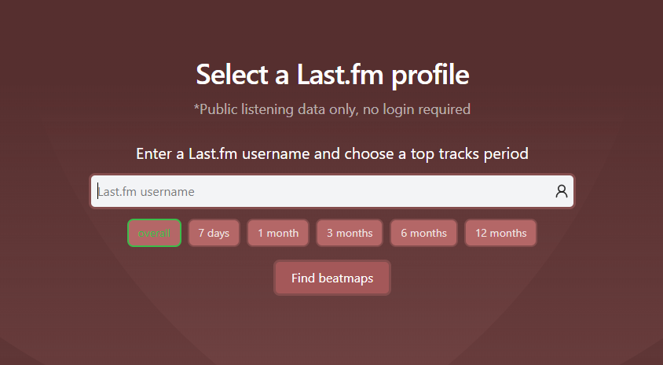
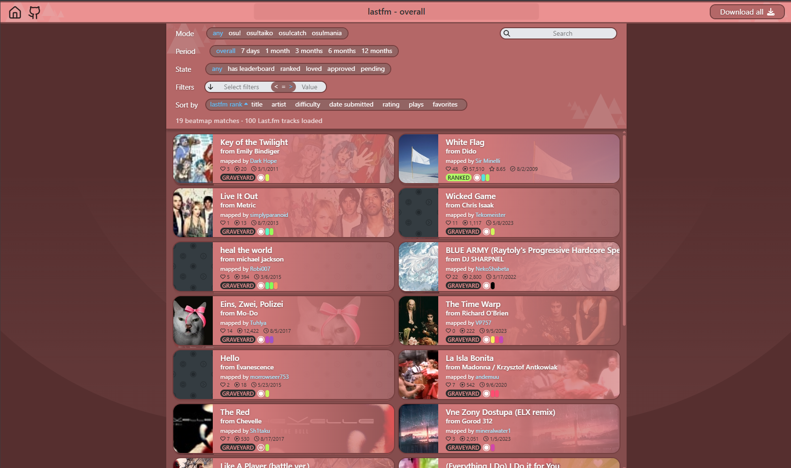
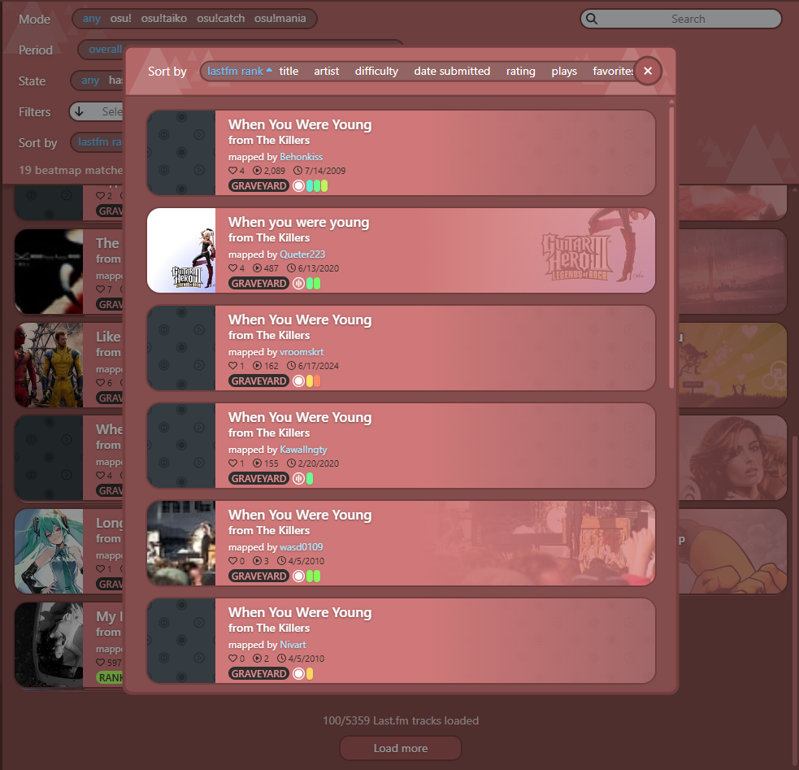

<div align="center">

# [osu-lastfm](https://github.com/codenm/osu-lastfm)

_Find osu! beatmaps from a public Last.fm profile. No login, no playlist export, just your listening history pointed at osu!_

[](https://github.com/codenm/osu-lastfm)
[](https://github.com/yaGeey/osu-find-songs)
[](https://www.last.fm/api)
[](https://osu.ppy.sh)

</div>

---

<p align="center">
   <strong style="font-size: 20px;">From Last.fm to osu!</strong>
</p>

<div align="center">



</div>

<br>

- Pick any public Last.fm profile and choose a top-track period.
- The app reads public listening history through Last.fm, then searches osu! for matching beatmapsets.
- Results keep Last.fm rank metadata, so the first matches can stay close to the user's actual listening order.

---

<p align="center">
   <strong style="font-size: 20px;">Search, filter, sort, download</strong>
</p>

<div align="center">



<br>



</div>

<br>

- Filter by osu! mode, beatmap state, and numeric beatmap attributes.
- Search across beatmap metadata and the original Last.fm track data.
- Sort by Last.fm rank, title, artist, difficulty, date submitted, rating, plays, and favourites.
- Download one beatmap at a time, or bundle selected matches into a zip

---

### Setup

Create a local `.env.local` file:

```text
LASTFM_API_KEY=
OSU_CLIENT=
OSU_SECRET=
```

`LASTFM_API_KEY` is the developer-owned Last.fm API key. Users only enter a public Last.fm username in the app.

If deploying the app, set `NEXT_PUBLIC_SITE_URL` to the public app URL so metadata, robots, and sitemap output use the deployed site instead of the repository fallback.

```bash
npm ci
npm run dev
```

Release checks:

```bash
npm run lint
npm test
npm run build
```

---

### Fork note

This repository is derived from [`yaGeey/osu-find-songs`](https://github.com/yaGeey/osu-find-songs).

---

### Technical app logic


```mermaid
flowchart TD
   A["Client route: /from-lastfm/[username]?period=&m=&s=&sort=&q="] --> B["React Query: lastfm-top-tracks-infinite"]
   B --> C["Server action: getLastfmTopTracks()"]
   C --> D["Last.fm user.getInfo"]
   C --> E["Last.fm user.getTopTracks period + page + limit"]
   D --> F["Normalised LastfmUser"]
   E --> G["Normalised LastfmTrack[] with rank, artist, title, playcount"]
   F --> H["LastfmTopTracksResult"]
   G --> H

   H --> I["Client chunks tracks by LASTFM_CHUNK_SIZE"]
   I --> J["React Query useQueries: search-from-lastfm per chunk"]
   J --> K["POST /api/batch/osu-search"]
   K --> L["RateLimitManager osu queue"]
   L --> M["beatmapsSearch()"]
   M --> N{"osuToken cookie exists?"}
   N -- "yes" --> O["Use cached bearer token"]
   N -- "no" --> P["POST osu! OAuth client_credentials"]
   P --> Q["Set httpOnly osuToken cookie"]
   O --> R["GET osu! /api/v2/beatmapsets/search"]
   Q --> R

   R --> S["Batch response: BeatmapSet[] | null per Last.fm track"]
   S --> T["Attach lastfmRank + lastfmTrack"]
   T --> U["Flatten query results"]
   U --> V["Filter by state, mode, numeric filters, and text search"]
   V --> W["Deduplicate beatmapset IDs"]
   W --> X["Sort via query sort option"]
   X --> Y["Render card grid or virtualised list"]

   Y --> Z["Single download"]
   Y --> AA["Download all"]
   Z --> AB["fetchBeatmapWithFallback()"]
   AA --> AC["Sort each match group, fetch best candidate, create zip"]
   AC --> AB
   AB --> AD["Prioritised mirrors: catboy, sayobot, osu.direct, akatsuki, nerinyan, gatari"]
   AD --> AE["Save .osz or generated zip in browser"]
```
