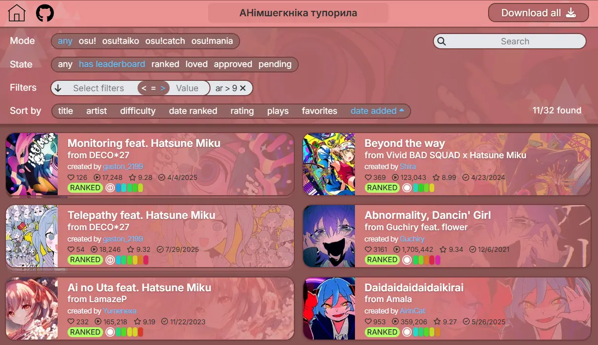
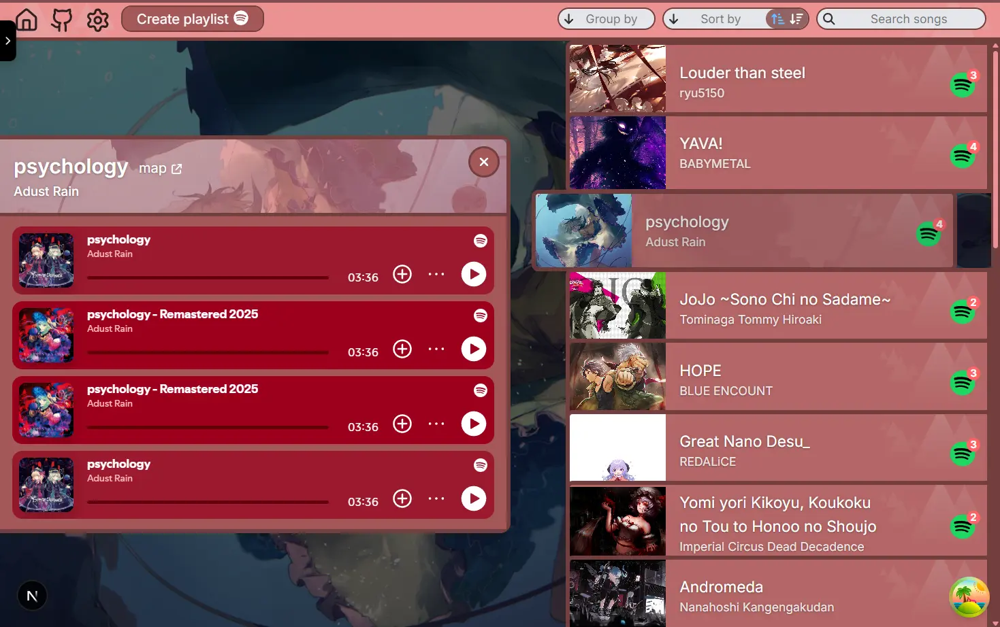

# [osufindsongs](https://osu.yageey.me)

_A tool that links osu! with Spotify: scan your osu! songs to get playlists, or find beatmaps from a playlist_ 🎮🎶

   

---

   <strong style="font-size: 20px;">🎧 From Spotify to osu!</strong>

  

 

- 🎵 Pick any public Spotify playlist and the app will try to match each track to osu! beatmaps.
- 📊 You can filter, sort and search results with all the options provided by osu search queries and even custom one.
- 💾 Once you're happy with the results, you can download each beatmap individually — or grab them all in a single zip archive.

---

   <strong style="font-size: 20px;">🎮 From osu! to Spotify</strong>

  

 

**Transform your osu! library into Spotify playlists!**

- 💻 Select a folder with your map. App will automatically searches for those songs on Spotify and YouTube.
- 🔎 You can view, listen or watch videos in the app, and instantly generate a Spotify playlist.
- 🗂️ Similarly to the native osu! client, you can organize your songs exactly the way you're used to.

---

### Try it out!

I hope you find this tool useful and fun to use. I really put soul in it.
Thanks for checking it out - and even bigger thanks if you decide to give it a try!💗
And even bigger thanks if you consider to star the repo!

ThunderBirdo featured my app in [his video](https://www.youtube.com/watch?v=0uZ4RehxDO4&t=300s&ab_channel=ThunderBirdo)! Just note: the map background issue on cards is already fixed, and the video only covers the `from-osu` page.

---

### Technical stuff

The core application logic orchestrates via Next.js on Vercel while offloading resource-intensive scraping to a dedicated Digital Ocean VPS. This specialized microservice employs Playwright to emulate authentic user sessions, retrieving headers, tokens and dynamic query hashes.
System observability and data integrity are maintained through a telemetry stack featuring NeonDB for serverless SQL analytics and LaunchDarkly for live sessions recordings and error logging.

