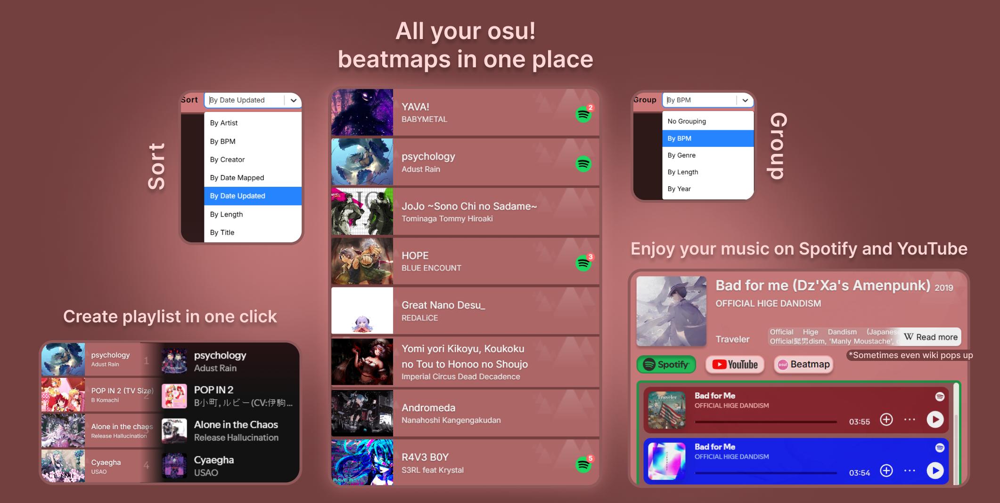

### 🔗 https://osufindsongs.vercel.app
This is my pet project I built to connect **osu** with **Spotify**. It features two main tools:

---

   <strong style="font-size: 20px;">From osu! to Spotify</strong>
  

Just point to your `Songs/` folder, and the app will scan all your `.osu` files to extract track metadata. It then automatically searches for those songs on **Spotify, YouTube, and Wikipedia** (to get artist info). You can view listen or watch videos in app, and instantly **generate a Spotify playlist**. There's also advanced **sorting, filtering, search, and grouping**, similar to the native osu! client, so you can organize your songs exactly the way you're used to.

---

   <strong style="font-size: 20px;">From Spotify to osu!</strong>
  

Pick any **public Spotify playlist** and the app will try to match each track to **osu! beatmaps**. You can **filter, sort and search** results with all the options provided by osu search queries and even custom one. Once you're happy with the results, you can **download** each beatmap individually — or grab them all in a single zip archive. The app picks the "best match" per track using your sorting preferences.

---

### Try it out!

> For **minimal usage** I suggest throw your osu songs folder at app, wait for a couple of minutes and get freshly new Spotify playlist to listen.

I hope you find this tool useful and fun to use. I really put soul in it.
Thanks for checking it out — and even bigger thanks if you decide to give it a try!💗
And even bigger thanks if you consider to star the repo!

ThunderBirdo featured my app in [his video](https://www.youtube.com/watch?v=0uZ4RehxDO4&t=300s&ab_channel=ThunderBirdo)! Just note: the map background issue on cards is already fixed, and the video only covers the `from-osu` page.

---

### Tech stack
- Full Next JS with Tailwind with type safety (I guess), axios + tanstack query
- **APIs used**: osu api, spotify api with users oAuth, wiki api, youtube (scraping lib)
- **Optimization**: list virtualization, batching queries on apps api
etc. Sadly ChatGPT can't read all my files, and I don't have CLI AI tools to write all my tech stack 😼